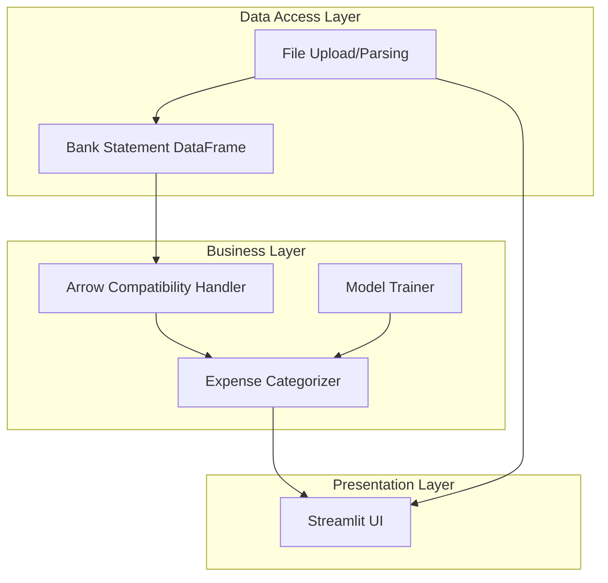
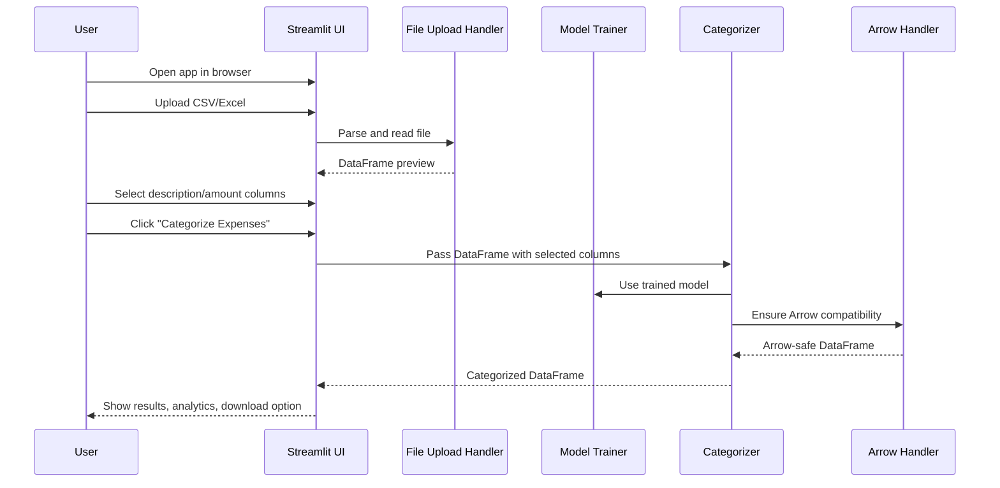

# Smart Expense Categorizer Feature Documentation

## Overview

The **Smart Expense Categorizer** is a Streamlit-based web application designed to intelligently categorize expenditures from Indian bank statements. Using machine learning (NLP with TF-IDF vectorization and a Naive Bayes classifier), the app predicts categories for each transaction based on its description. Users can upload CSV or Excel files, preview data, configure important columns, run AI-powered categorization, analyze their spending, and download results.

This tool streamlines personal finance management by automating tedious expense classification, offering instant analytics, and supporting a variety of Indian financial platforms and terminologies. The intuitive UI ensures accessibility for all users, while robust error handling and data compatibility checks provide reliability.

---

## Architecture Overview



---

## Component Structure

### 1. Presentation Layer

#### **Streamlit UI** (`expense_app.py`)
- **Purpose**: Provides the interactive web interface for file upload, column selection, categorization, analytics, and download.
- **Key Properties**:
    - Title and description
    - File uploader widget
    - Data preview table
    - Column selection dropdowns
    - Categorize button
    - Analytics visualization (bar chart, value counts)
    - Download button for results
    - Error/info dialogs

- **Key Methods**:
    - `st.file_uploader()`: Handles file input.
    - `st.selectbox()`: Lets users pick description/amount columns.
    - `st.button("Categorize Expenses")`: Triggers categorization.
    - `st.dataframe()`, `st.bar_chart()`, `st.download_button()`: For data display and interaction.

---

### 2. Business Layer

#### **Model Trainer** (`expense_app.py`)
- **Purpose**: Prepares and fits the machine learning pipeline on startup using labeled example data.
- **Key Methods**:
    - `train_model()`: Trains a Scikit-learn Pipeline (TF-IDF + MultinomialNB) on Indian-context phrases and categories.

#### **Expense Categorizer** (`expense_app.py`)
- **Purpose**: Applies the trained model to user-uploaded transaction descriptions and assigns categories.
- **Key Methods**:
    - `model.predict()`: Predicts a category for each transaction.

#### **Arrow Compatibility Handler** (`expense_app.py`)
- **Purpose**: Ensures the Pandas DataFrame can be serialized for Streamlit/Arrow, preventing serialization errors.
- **Key Methods**:
    - `make_arrow_compatible(frame: pd.DataFrame)`: Converts problematic columns to string or appropriate types.

---

### 3. Data Access Layer

#### **File Upload/Parsing** (`expense_app.py`)
- **Purpose**: Reads and parses user-uploaded CSV or Excel files into Pandas DataFrames.
- **Key Methods**:
    - Conditional logic for handling `.csv` and `.xlsx` files, including encoding fallback.

#### **Bank Statement DataFrame** (`expense_app.py`)
- **Purpose**: Holds the uploaded data, intermediate, and processed data throughout the session.

---

### 4. Data Models

#### **Training Data Model**
- **Properties**:

| Property      | Type    | Description                                 |
|---------------|---------|---------------------------------------------|
| `training_data` | `List[Tuple[str, str]]` | List of (description, category) pairs for model training. |

#### **User Data Model** (Uploaded DataFrame)
- **Properties**: User-supplied columns (e.g., "Date", "Description", "Amount") plus "Predicted Category" added after processing.

---

### 5. API Integration

**No HTTP API endpoints are defined in this code.**  
All functionality operates locally in the Streamlit session.

---

## Feature Flows

### 1. User Expense Categorization Flow



---

## State Management

- **Initial**: Waiting for file upload.
- **File Uploaded**: Data previewed, columns selectable.
- **Categorization Running**: Spinner shown, disables UI.
- **Result**: Display of categorized data and analytics.
- **Error**: Error/information box shown.

---

## Integration Points

- **Pandas**: For data manipulation and file reading.
- **Scikit-learn**: For NLP feature extraction and classification.
- **PyArrow**: For data serialization (Streamlit compatibility).
- **Streamlit**: For UI and app orchestration.

---

## Analytics & Tracking

- **Screen Views**: Main dashboard, data preview, analytics section.
- **User Actions**:
    - File upload
    - Column selection
    - Categorization trigger
    - CSV download

---

## Key Classes Reference

| Class / Function         | Location         | Responsibility                                    |
|-------------------------|------------------|---------------------------------------------------|
| `train_model`           | expense_app.py   | Trains the TF-IDF + Naive Bayes pipeline          |
| `make_arrow_compatible` | expense_app.py   | Ensures DataFrame serialization compatibility     |
| Streamlit UI Components | expense_app.py   | Orchestrate user workflow                         |

---

## Error Handling

- **File Type Detection**: Only `.csv` and `.xlsx` files accepted; others trigger error.
- **Encoding Fallback**: Attempts alternate encoding for CSVs if default fails.
- **Arrow Serialization Protection**: Converts problematic columns to string when Arrow cannot serialize.
- **Column Existence Checks**: Ensures selected columns exist; else, stops with error.
- **Amount Parsing**: Handles currency signs, commas, and conversion errors gracefully.
- **General Exception Handling**: Catches and displays any error during file processing.

**Example:**

```python
if file_extension == ".csv":
    try:
        df = pd.read_csv(uploaded_file)
    except UnicodeDecodeError:
        df = pd.read_csv(uploaded_file, encoding="latin1")
elif file_extension == ".xlsx":
    df = pd.read_excel(uploaded_file)
else:
    st.error("Unsupported file format!")
    st.stop()
```

---

## Caching Strategy

- **No explicit caching** is implemented in the code.
- Model is trained on every script run; data is processed per session.

---

## Dependencies

- **streamlit**
- **pandas**
- **scikit-learn**
- **pyarrow**

---

## Testing Considerations

- **Test all file upload scenarios**: CSV, XLSX, invalid files, encoding variants.
- **Try missing/extra columns**: Ensure errors are handled.
- **Validate categorization**: Known descriptions yield correct categories.
- **Check download**: Downloaded file matches processed data.

---

# Interactive API Documentation

> The application does not expose HTTP API endpoints; all logic is contained in the Streamlit session.

---

## Features

- 📝 **Upload CSV or Excel bank statements**
- 🤖 **Automatic AI-powered categorization** (trained on Indian merchant/expense patterns)
- 🧠 **NLP engine**: TF-IDF + Naive Bayes for smart predictions
- 📊 **Spending analytics**: Bar charts & category breakdowns
- 📥 **Download categorized results**
- 🛡️ **Robust error handling** and compatibility with complex input files
- ⚙️ **Configurable column selection**
- 💡 **Sample statement and clear guidance**

---

## Tech Stack

- **Python 3.8+**
- **Streamlit** (UI and app framework)
- **pandas** (data handling)
- **scikit-learn** (NLP and classification)
- **pyarrow** (data serialization)

---

## Usage Instructions

1. **Install dependencies:**

    ```bash
    pip install streamlit pandas scikit-learn pyarrow
    ```

2. **Run the app:**

    ```bash
    streamlit run expense_app.py
    ```

3. **Use the web UI:**
    - Upload your bank statement file (`.csv` or `.xlsx`)
    - Select the transaction description and (optionally) amount columns
    - Click **Categorize Expenses**
    - Explore your spending analytics and download the results as CSV

---

## Screenshots

> _Add screenshots here after running the app (e.g., upload, categorization, analytics, download button)._

---

## Deployment Steps

1. **Clone the repository:**

    ```bash
    git clone https://github.com/yourusername/smart-expense-categorizer.git
    cd smart-expense-categorizer
    ```

2. **Install requirements:**

    ```bash
    pip install -r requirements.txt
    ```

3. **Launch the app:**

    ```bash
    streamlit run expense_app.py
    ```

4. **(Optional) Deploy to Streamlit Cloud:**
    - Push your code to GitHub.
    - Go to [streamlit.io/cloud](https://streamlit.io/cloud) and connect your repository.

---

## Future Improvements

- Add support for PDF and bank-specific statement formats
- Expand training data for more granular categories
- Persist user models for personalized learning
- Add user authentication for multi-user support
- Visualize transactions on a timeline or calendar view

---

## License

This project is licensed under the MIT License.

---

